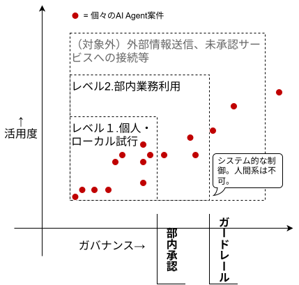
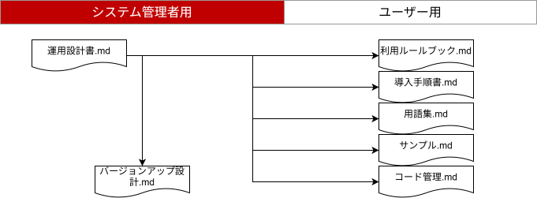

# AI Agent 運用設計書

## 目的
安全にAI Agent活用度を高めること

## 対象
AI Agentを導入・展開・運用するシステム管理者  
AI Agentを利用するユーザー

## 1. 前提

| 項目 | 内容 |
|---|---|
| **既存ルール準拠** | AI Agent利用に関するルール以外は、既存の社内ルール・部内ルールに準拠する。 |
| **情報管理** | 機密情報の入力は、社内の情報管理規定に準じる。 |

## 2. 活用度の定義

本設計の目的は、**安全にAI Agent活用度を高めること**です。活用度レベルが上がれば、利用人数・対象業務・効果が増える一方で、リスクも高まります。そのため、活用度に応じて要求されるガバナンスレベルを上げます。

### 2-1. 評価軸

| 評価軸 | 細目 |
|---|---|
| **活用度** | 利用人数、対象業務数、効果 |
| **ガバナンス** | 品質、リスク管理、セキュリティ要求、コスト |

### 2-2. 活用度レベル

| レベル | 目的 | 主な運用 |
|---|---|---|
| **1 個人・ローカル試行** | 小さく試す | PCローカルで試行する。個人的に使用する。外部送信・本番影響・機密情報利用はしない。 |
| **2 チーム内利用** | チーム内に展開する | 便利ツールとして利用モジュール、使い方、前提、制限を共有する。 |
| **3 部内業務利用** | 業務に組み込む | 有効性・安全性を確認するため、部門長承認、責任者レビュー、組織指定のGit基盤保存、運用方法を明確にする。 |

**対象外**：外部情報送信、未承認サービス接続、費用発生を伴うサーバー利用は本稿の通常利用範囲外とし、個別承認とする。

## 3. 想定リスク

運用設計をするにあたって想定する主要リスクは次の通りです。リスクは重複を避けるため、原因が近いものを統合しています。

| ID | リスク | 説明 | 主な対策 |
|---|---|---|---|
| R1 | **ローカル・ブラックボックス化** | PCローカルで仕組みが作られ、作成者しか、または作成者すら仕組みを説明できない状態になる。 | README、組織指定のGit基盤保存、レビュー、利用モジュール共有 |
| R2 | **ローカル環境の破損** | AI Agentの誤操作により、PCローカルのファイル・フォルダを削除・上書きしてしまう。 | Sandbox、コマンド制限、バックアップ |
| R3 | **データの散逸** | 既存データベースがあるにも関わらず、独自データが作成され、業務利用される。 | 既存基盤利用、保存場所整理、データ利用レビュー |
| R4 | **Secret混入** | APIキー、秘密鍵、接続文字列などをコード・ログ・組織指定のGit基盤へ混入させる。 | deny / ignore、Secret読取制限、.gitignore、Secretスキャン |
| R5 | **情報漏洩・外部送信** | Agentやツールが、機密情報・個人情報・業務データを外部へ送信してしまう。 | ネットワーク制限、外部接続許可リスト、Approval、Hook |
| R6 | **外部への不正アクセス** | 許可されていない頻度のスクレイピング、認証突破、利用規約違反の取得を行う。 | 接続先制限、利用目的確認、外部アクセス承認 |
| R7 | **未許可ランタイム・不正モジュール・サプライチェーン** | 会社の許可リストにないPython、Node.js等のプログラムランタイム、またはリスクを考慮していないライブラリ、MCP、Plugin、サンプルコードを使う。 | ランタイム許可リスト、ローカル許可済みパッケージリスト、インストールHook/ラッパー、依存関係チェック、標準インストーラー |
| R8 | **バージョン差異** | 最新のリスク対策が入っていないAgent本体・標準設定・Hookを使い続ける。 | 標準版、更新期限、ハートビート、設定ハッシュ |
| R9 | **コスト膨張** | 再試行、探索、テスト、API呼び出しにより、トークン・API・サーバー費用が膨らむ。 | 利用量監視、上限設定、実行時間制限、Approval |
| R10 | **プロンプトインジェクション** | Web、PDF、メール、README、ログ等に埋め込まれた悪意ある指示をAgentが命令として扱う。 | 外部コンテンツ読取制限、指示優先順位、Approval、Hook |
| R11 | **過剰権限・過剰自律性** | Agentにファイル、コマンド、外部接続、API実行などの広い権限を与え、被害範囲が広がる。 | 最小権限、Sandbox、Permission、Approval、接続許可リスト |
| R12 | **AI生成コードの脆弱性混入** | AIが生成したコードに、認証不備、権限チェック漏れ、脆弱な実装、秘密情報の直書きが混入する。 | セルフ・セキュリティ・チェック、静的解析、テスト、人間レビュー |
| R13 | **承認疲れ・誤承認** | Approvalが多すぎる、または内容が分かりにくく、利用者が意味を理解せず承認する。 | 高リスク操作への承認絞り込み、承認内容の要約、教育 |
| R14 | **無限ループ・大量実行** | Agentが再試行や探索を繰り返し、大量のトークン、API、ファイル操作を発生させる。 | 回数制限、時間制限、トークン上限、異常検知 |
| R15 | **ログ・監査不足** | Agentが何を読み、何を変更し、何を拒否されたかが追えず、事故後に原因調査できない。 | 導入ログ、拒否イベント、エラー記録、設定ハッシュ |

## 4. 技術設計

AI Agentは標準インストーラーで導入されていることを前提とします。標準インストーラーにより、標準設定、ガードレール、テンプレート、バージョン管理の仕組みを適用します。

Sandboxは標準ガードレールの一部として、AI Agentが操作できる作業フォルダ・実行範囲を限定します。利用者がSandboxを個別に設計・判断する前提にはせず、管理者側で標準インストーラーと導入確認に組み込みます。

ただし、ガードレールは完全ではありません。AI Agentの出力、外部情報の扱い、承認操作、機密情報の扱いは、利用者自身の確認が必要です。不明点がある場合は、個人判断で進めず管理者に相談する運用と組み合わせます。

ローカルリポジトリに仕組みができた場合は、セルフ・セキュリティ・チェックを標準的な確認手順に含めます。実行手順・実行コマンドは自社が指定するセルフ・セキュリティ・チェックツールのリポジトリを正とします（参照先は導入時に各社で設定してください。例: `<社内コード管理基盤>/self_security_check`）。他の子文書（利用ルールブック、コード管理ルール、導入手順書）はこの節を参照します。

プログラムランタイムは、会社のソフトウェア導入許可リストと指定手順に従います。Python/npm等のライブラリは、標準インストーラーで配布されるローカルの許可済みパッケージリストを参照し、Hookまたはラッパーで `pip install` / `npm install` 等の実行前に確認します。許可リスト外のライブラリは導入を停止し、AIガバナンスチームまたは管理者への相談・例外申請に回します。

技術設計は、**仕組みで止める・制限する・検知する対策**に限定します。人間のレビュー、承認、教育、例外判断は次章の運用設計に分けます。  
下表では、横軸に想定リスクのR番号を置き、各対策が主に効くリスクに **レ** を付けています。右端の備考には、主な限界と補完する運用を記載します。

| 項目1 | 項目2 | R1 | R2 | R3 | R4 | R5 | R6 | R7 | R8 | R9 | R10 | R11 | R12 | R13 | R14 | R15 | 備考 |
|---|---|---:|---:|---:|---:|---:|---:|---:|---:|---:|---:|---:|---:|---:|---:|---:|---|
| 標準化 | **標準インストーラー**：Agent本体、標準設定、テンプレート、Hook等をまとめて導入する。 |  |  |  |  |  |  | レ | レ |  |  | レ |  |  |  |  | 未承認構成や古い構成を減らす。補完：更新期限・未更新者フォロー。 |
| 標準化 | **ランタイム・ライブラリ許可リスト**：ランタイムは会社のソフトウェア導入許可リストに従い、ライブラリはローカルの許可済みパッケージリストとHook/ラッパーで導入前に確認する。 |  |  |  |  |  | レ | レ | レ |  |  | レ | レ |  |  |  | 許可済みでも安全性を完全保証しない。補完：依存関係チェック、Security Check、例外申請、定期棚卸し、許可リスト更新。**ランタイムのバージョンアップ運用**：winget / choco / pipx 等の install・upgrade を Hook でブロック。Python/Node.js 等のバージョンアップは IT 管理部門の正規プロセスで実施。Guardrail 自体の更新は管理者が新インストーラーを実行。プロジェクト内ライブラリの `pip install --upgrade` は allowlist check を経由するため別扱い。 |
| 標準化 | **インストールHook / ラッパー**：`pip install` / `npm install` 等を実行前に捕捉し、許可済みパッケージリストと照合する。 |  |  |  |  |  | レ | レ | レ | レ |  | レ | レ | レ | レ | レ | 直接コマンド回避や別経路導入は残る。補完：標準手順、端末権限、教育、例外申請。 |
| 標準化 | **許可済みパッケージリスト管理**：パッケージ名、エコシステム、許可バージョン、状態、理由、確認日、管理者を定義する。 |  |  |  |  |  | レ | レ | レ |  |  | レ | レ |  |  | レ | リストの陳腐化が残る。補完：定期更新、脆弱性情報確認、申請結果の反映。 |
| 標準化 | **標準設定**：利用可能な機能、接続先、承認要否、ログ設定を統一する。 |  |  |  |  | レ | レ |  | レ |  |  | レ |  | レ |  |  | 設定だけでは利用者の誤判断は防げない。補完：教育・レビュー。 |
| 標準化 | **AGENTS.md / CLAUDE.md**：Agentの作業方針、禁止事項、指示優先順位を記載する。 | レ |  |  |  |  |  |  |  |  | レ |  | レ |  |  |  | 外部文書の悪意ある指示より社内ルールを優先させる。補完：外部情報利用時の確認。 |
| 実行環境 | **Sandbox**：Agentが操作できるファイル範囲・実行範囲を限定する。 |  | レ |  |  |  |  |  |  |  |  | レ |  |  |  |  | 外部送信、Secret混入、品質不良は単独では防げない。補完：ネットワーク制限、Secret確認、コードレビュー。 |
| 実行環境 | **PCローカル実行原則**：初期利用は利用者PC上で実行し、サーバー利用は別途検討する。 |  |  |  |  |  |  |  |  | レ |  | レ |  |  |  |  | サーバー費用や本番影響を抑えるが、ローカル破損は残る。補完：Sandbox・バックアップ。 |
| 接続制御 | **MCP / Plugin / API 許可リスト**：利用してよい外部接続・拡張機能だけを許可する。 |  |  |  |  | レ | レ | レ |  |  | レ | レ |  |  |  |  | 許可済みツール自体の脆弱性や過剰権限は残る。補完：権限棚卸し、依存関係チェック。 |
| 接続制御 | **ネットワークアクセス制限**：Agentやツールが外部ネットワークへ接続できる範囲を制限する。 |  |  |  |  | レ | レ |  |  |  | レ |  |  |  |  |  | ローカル破損や品質不良は防げない。補完：Sandbox、コードレビュー。 |
| 入力制御 | **外部コンテンツ読取制限**：Web、PDF、メール、ログ等を無制限に読ませない。 |  |  |  |  | レ |  |  |  |  | レ |  |  |  |  |  | 読ませる必要がある場合は残余リスクが残る。補完：信頼性確認、引用元確認。 |
| 情報保護 | **deny / ignore**：Agentに読ませないファイル・フォルダを指定する。 |  |  |  | レ | レ |  |  |  |  | レ |  |  |  |  |  | 読ませた外部文書内の悪意ある指示は防げない。補完：外部情報利用確認、プロンプトインジェクション教育。 |
| 情報保護 | **Secret配下の読取制限**：秘密鍵、認証情報、接続文字列をAgentから読めないようにする。 |  |  |  | レ | レ |  |  |  |  |  |  |  |  |  |  | Secretを作業フォルダ内に置くと防げない場合がある。補完：.gitignore確認、Secretスキャン、レビュー。**v0.2実装範囲**：blocked_paths（Bash経由）＋ PreToolUse Edit/Write Hook による file_path チェック＋ UserPromptSubmit によるプロンプトスキャン＋ PostToolUse による出力スキャン（警告のみ）。正規表現ベースのため回避可能性は残る（[既知の限界.md](既知の限界.md) §2 参照）。 |
| 情報保護 | **.gitignore / Secretスキャン**：Git管理除外と機密情報検知を行う。 |  |  |  | レ |  |  |  |  |  |  |  |  |  |  | レ | 検知漏れは残る。補完：push前確認、Security Check結果レビュー。 |
| 実行制御 | **Permission / Approval**：高リスク操作の前に承認を求める。 |  |  |  |  | レ |  |  |  |  | レ | レ |  | レ | レ |  | 承認疲れや誤承認があると機能しない。補完：承認観点明確化、教育、承認対象の絞り込み。 |
| 実行制御 | **コマンド制限**：削除、上書き、大量変更、権限変更などを制限する。 |  | レ |  |  |  |  |  |  |  |  | レ |  |  | レ |  | 許可されたコマンドの誤用は残る。補完：Sandbox、承認、差分確認。 |
| 実行制御 | **Hook**：Agentの実行前後にチェック処理を差し込む。 |  |  |  | レ | レ | レ |  |  | △ |  |  |  |  | △ |  | 業務妥当性やすべての文脈判断はできない。補完：人間レビュー、例外申請。R10（プロンプトインジェクション）への直接的な実装はなし（AGENTS.md の指示優先順位・managed-settings の Permission 設定で間接補完）。**R9・R14 への対応（△: 部分実装）**：同一セッションの Edit/Write 等のファイル変更回数を%TEMP%のローリングウィンドウで計測。100回→stderr 警告、200回→当該セッションの変更操作だけを停止。設定は `guardrail_policy.json` の `mutating_tool_call_limits`。**機密情報保護のカバー範囲**：Bash 経由 blocked_paths ＋ PreToolUse Edit/Write file_path チェック（ブロック）＋ UserPromptSubmit credential スキャン（ブロック）＋ PostToolUse credential スキャン（警告のみ）をすべて実装済み。検出パターン: AWS キー・GitHub トークン・JWT・OpenAI/Anthropic API キー・DB 接続文字列・秘密鍵ヘッダー等。文字列マッチのため回避可能性は残る（[既知の限界.md](既知の限界.md) §2 参照）。 |
| コスト制御 | **トークン・時間・回数上限**：利用量、実行時間、API呼び出し回数を制限する。 |  |  |  |  |  |  |  |  | △ |  |  |  |  | △ |  | 必要な長時間処理まで止まる可能性がある。補完：例外申請、費用レビュー。**実装状況（△）**：Claude Code 本体設定（`--max-turns` 等）による間接的な効果のみ。我々のガードレールコードでの直接制御は Hook 呼び出し回数制限のみ（Hook 行参照）。`check_status.ps1` によるセッション別トークン使用量レポートを追加（事後検知）。 |
| コード管理 | **組織指定のGit基盤保存**：作成したコードを社内のコード管理基盤に保存する。 | レ |  | レ |  |  |  |  |  |  |  |  |  |  |  | レ | 保存だけでは品質は保証しない。補完：README、レビュー。 |
| コード管理 | **READMEテンプレート**：目的、起動方法、前提、制限、注意点の記載欄を用意する。 | レ |  |  |  |  |  |  |  |  |  |  | レ |  |  |  | 記載内容の正しさは自動保証されない。補完：コードレビュー。 |
| 品質確認 | **セルフ・セキュリティ・チェック / 静的解析 / 依存関係チェック**：生成コードと依存ライブラリを機械的に確認する。 |  |  |  |  |  |  | レ |  |  |  |  | レ |  |  |  | 検出できない設計不備や業務妥当性は残る。補完：人間レビュー。ローカルリポジトリ作成後はセルフ・セキュリティ・チェックを実行する。 |
| バージョン管理 | **標準版・更新期限・ハートビート・設定ハッシュ**：導入状態と設定差異を確認する。 |  |  |  |  |  |  |  | レ |  |  |  |  |  |  | レ | 事故の発生自体は止めない。補完：定期点検、未更新者フォロー。**v0.2 実装状況**：設定ハッシュ（`installed_hashes.csv` による SHA256 照合）のみ実装済み。ハートビートと更新期限通知は未実装（docs/必要な仕組み一覧.md §2 ロードマップ参照）。 |
| ログ・監査 | **導入ログ・拒否イベント・エラー記録**：何が止められたか、どこで失敗したかを記録する。 |  |  |  |  |  |  |  |  | レ |  |  |  |  | レ | レ | 事故の未然防止そのものではない。補完：定期点検、インシデント初動。 |

## 5. 運用設計

運用設計は、**人間が判断する・確認する・教育する・例外処理する対策**に限定します。  
下表では、横軸に想定リスクのR番号を置き、各対策が主に効くリスクに **レ** を付けています。

| 項目1 | 項目2 | R1 | R2 | R3 | R4 | R5 | R6 | R7 | R8 | R9 | R10 | R11 | R12 | R13 | R14 | R15 |
|---|---|---:|---:|---:|---:|---:|---:|---:|---:|---:|---:|---:|---:|---:|---:|---:|
| 利用管理 | **Level別利用管理**：個人試行、チーム利用、部内業務利用で求める確認を変える。 | レ |  | レ |  | レ |  |  |  | レ |  | レ |  |  |  |  |
| 承認 | **部門長承認**：部内業務利用に進める前に、目的、利用範囲、責任者、運用方法、リスク対策について部門長承認を受ける。 | レ |  | レ |  | レ |  |  |  | レ |  | レ | レ |  |  |  |
| 事前確認 | **外部情報利用の確認**：Web、PDF、メール、ログをAgentに読ませる前に、信頼性と必要性を確認する。 |  |  |  |  | レ |  |  |  |  | レ |  |  |  |  |  |
| 事前確認 | **ランタイム・ライブラリ導入確認**：Agentからランタイムやライブラリ導入を提案された場合、ランタイムは会社の許可リスト、ライブラリは許可済みパッケージリスト・指定手順に従う。 |  |  |  |  |  | レ | レ | レ |  |  | レ | レ | レ |  |  |
| 承認 | **例外申請・相談先の明確化**：外部送信、未承認サービス、サーバー利用は個別承認とする。 |  |  |  |  | レ | レ |  |  | レ |  | レ |  |  | レ |  |
| 承認 | **承認観点の明確化**：承認時に、対象ファイル、外部送信先、実行コマンド、費用影響を確認する。 |  |  |  |  |  |  |  |  |  | レ |  |  | レ | レ |  |
| レビュー | **コードレビュー**：生成コードの目的、処理内容、入力・出力、権限、例外処理を確認する。 | レ |  |  |  |  |  |  |  |  |  | レ | レ |  |  |  |
| レビュー | **セルフ・セキュリティ・チェック結果レビュー**：ローカルリポジトリ作成後のチェック結果と静的解析結果を人間が確認する。 |  |  |  | レ |  |  | レ |  |  |  |  | レ |  |  |  |
| コード管理 | **組織指定のGit基盤 push確認**：部内業務利用へ進む前に、コード、README、.gitignoreの保存を確認する。 | レ |  | レ | レ |  |  |  |  |  |  |  |  |  |  |  |
| データ管理 | **既存基盤利用の確認**：独自データを作る前に、既存DB・共有基盤・保存場所を確認する。 |  |  | レ |  |  |  |  |  |  |  |  |  |  |  |  |
| 教育 | **プロンプトインジェクション教育**：外部文書内の指示をAgentが信じる可能性を利用者へ伝える。 |  |  |  |  |  |  |  |  |  | レ |  |  | レ |  |  |
| 教育 | **承認疲れ対策**：承認は読まずに押すものではなく、危険操作の最終確認であることを教育する。 |  |  |  |  |  |  |  |  |  |  | レ |  | レ |  |  |
| 点検 | **利用量・費用レビュー**：利用量、エラー、拒否イベント、費用を定期確認する。 |  |  |  |  |  |  |  |  | レ |  |  |  |  | レ |  |
| 点検 | **バージョン・設定点検**：未更新者、設定差異、古いHookを確認する。 |  |  |  |  |  |  |  | レ |  |  |  |  |  |  |  |
| 点検 | **権限棚卸し**：Agent、MCP、Plugin、API、リポジトリ権限を定期的に確認する。 |  |  |  |  |  |  | レ |  |  |  | レ |  |  |  |  |
| 事故対応 | **インシデント初動**：Secret混入、誤送信、誤削除、費用異常時の報告先と初動を定める。 |  | レ |  | レ | レ |  |  |  | レ |  |  |  |  | レ | レ |
| 改善 | **FAQ・ヒヤリハット反映**：活用事例、事故、問い合わせを定期的に反映する。 | レ | レ | レ | レ | レ | レ | レ | レ | レ | レ | レ | レ | レ | レ | レ |

## 6. セキュリティ対策マトリクス

想定リスクごとに、この標準パッケージによるカバー状況を一覧化します。カテゴリは第4章・第5章の分類を踏襲しています。`●` は標準パッケージで実装済み、`◐` は部分実装、`○` は主に運用で対応、`—` は標準パッケージの直接の対象外を表します。いずれも残余リスクは残るため、備考の補完策を併用します。

HTML版（この表のみ）: [security_controls_matrix.html](security_controls_matrix.html)

| リスク | 主な対策カテゴリ | 標準パッケージでのカバー状況 | 運用での補完 | 主な残余リスク・根拠 |
|---|---|---|---|---|
| R1 ローカル・ブラックボックス化 | コード管理 / 標準化 | ◐ READMEテンプレート・標準構成を配布 | 組織指定のGit基盤保存、レビュー | 保存・記載は利用者の実施が前提 |
| R2 ローカル環境の破損 | 実行環境 / 実行制御 | ◐ Sandbox・承認・コマンド制限 | バックアップ、差分確認、事故初動 | 許可済み操作の誤用、Sandbox外への影響は残る |
| R3 データの散逸 | データ管理 / 利用管理 | ○ 仕組みによる直接制御なし | 既存基盤・保存場所の確認、部門長承認 | 利用者が独自データを作成することは技術的に止めない |
| R4 Secret混入 | 情報保護 / 実行制御 | ◐ blocked_paths、ファイルパス検査、Credentialスキャン | .gitignore、push前確認、レビュー | 正規表現・文字列一致のため検知漏れ・回避があり得る |
| R5 情報漏洩・外部送信 | 接続制御 / 情報保護 / 承認 | ◐ Sandbox・Permission/Approval・機密情報保護 | 接続先許可、ネットワーク制限、外部送信承認 | ネットワーク制御は環境・端末側の設定に依存 |
| R6 外部への不正アクセス | 接続制御 / 事前確認 | ○ 仕組みによる直接制御なし | 接続先制限、利用目的確認、個別承認 | スクレイピング頻度や規約適合性をHookでは判断しない |
| R7 未許可ランタイム・不正モジュール・サプライチェーン | 標準化 / 品質確認 | ◐ 許可リスト、install Hook/ラッパー、設定ハッシュ | 例外申請、依存関係確認、定期棚卸し | 直接コマンド回避、別経路導入、推移的依存は残る |
| R8 バージョン差異 | 標準化 / バージョン管理 | ◐ 標準インストーラー、設定ハッシュ | 更新確認、未更新者フォロー | ハートビート・更新期限通知は未実装 |
| R9 コスト膨張 | コスト制御 / 利用管理 | ◐ Claude Codeの回数制限、利用量レポート | 利用量・費用レビュー、上限・例外管理 | Codexでは直接の回数制限は発動しない |
| R10 プロンプトインジェクション | 入力制御 / 実行制御 / 教育 | ◐ AGENTS.md等の指示優先順位、Permission設定 | 外部情報の必要性確認、教育 | プロンプトインジェクションを直接検出・遮断するHookは未実装 |
| R11 過剰権限・過剰自律性 | 実行環境 / 接続制御 / 承認 | ◐ Sandbox、Permission/Approval、設定標準化 | 最小権限、権限棚卸し、部門長承認 | 利用者が許可した操作と外部ツールの過剰権限は残る |
| R12 AI生成コードの脆弱性混入 | 品質確認 / レビュー | ○ チェック手順・テンプレートを提供 | セルフ・セキュリティ・チェック、静的解析、テスト、レビュー | 生成コードの安全性を自動保証しない |
| R13 承認疲れ・誤承認 | 実行制御 / 教育 | ○ Approval機構を利用 | 承認観点の明確化、教育、対象の絞り込み | 承認操作の内容理解は自動判定できない |
| R14 無限ループ・大量実行 | コスト制御 / 実行制御 | ◐ Claude Codeの変更回数制限、利用量レポート | 時間・費用レビュー、例外管理 | Codexでは直接の回数制限は発動しない |
| R15 ログ・監査不足 | ログ・監査 / バージョン管理 | ◐ 導入ログ、拒否イベント、エラー記録、設定ハッシュ | 定期点検、インシデント初動 | 監査ログだけでは事故を防止できず、収集範囲にも限界がある |

この表の `●` / `◐` / `○` / `—` は、リスクが解消されたことを示すものではなく、標準パッケージの実装範囲を示します。詳細な技術対策は第4章、運用対策は第5章、既知の穴は [既知の限界.md](既知の限界.md) を正とします。

## 7. メンテナンスノート

### ライブラリ導入ガードレールの運用方針

| 項目 | 方針 |
|---|---|
| **方式** | 社内ミラーを前提にせず、標準インストーラーで配布するローカル許可済みパッケージリストを参照する。 |
| **更新** | 許可済みパッケージリストは標準モジュール配布時に更新し、設定ハッシュとバージョンで管理する。 |
| **判定** | deny リストと typosquat 疑いのみブロック、それ以外は自動通過（deny-list-only）。deny 該当は導入を停止し、AIガバナンスチームまたは管理者へ相談する。allow / review エントリは typosquat 検出の参照名として機能し、インストール審査の対象ではない。 |
| **対象** | まずはpip/npm等の主要導入経路から開始し、必要に応じて対象コマンドを増やす。 |
| **限界** | 許可済みパッケージでも後から脆弱性が見つかる可能性があるため、定期棚卸しとSecurity Checkで補完する。 |

### 重複チェック
| 観点 | 整理結果 |
|---|---|
| **情報漏洩とSecret混入** | Secret混入は「コード・ログ・リポジトリへ混ざるリスク」、情報漏洩は「外部送信されるリスク」として分離。 |
| **コスト膨張と無限ループ** | コスト膨張は結果、無限ループ・大量実行は原因として整理。ただし対策は重なるため、技術設計では同じ上限制御に集約。 |
| **未許可ランタイム・不正モジュールと未承認サービス** | ランタイムは会社のソフトウェア導入許可リストで制御し、ライブラリ・MCP・Pluginは許可リスト、依存関係チェック、リスク判定済みリストで制御する。未承認サービスは接続先・使い方の問題として整理。 |
| **プロンプトインジェクションと情報漏洩** | プロンプトインジェクションは攻撃手法、情報漏洩は発生しうる被害として整理。 |
| **技術設計と運用設計** | 技術設計は仕組み、運用設計は人間判断に限定して分離。両方ともR番号を横軸にしたマトリクスで対応関係を確認できるようにした。 |
| **ガードレール整理と技術設計** | ガードレール整理は技術設計と重複するため独立章を廃止し、技術設計マトリクスの備考欄に「限界」と「補完する運用」を統合した。 |
| **部内業務利用と部門長承認** | Level 3へ進める条件として、技術対策だけでなく部門長承認、責任者、運用方法、問い合わせ先を確認する。 |

### 文書構成

文書一覧は [docs/README.md](../README.md) を正としてください（本節は図の参照のみとし、ファイル名の重複記載はここでは行いません）。
## 基本コンセプト（Level 1）

### 1. ブラックボックス化を避ける

AI Agentの利用を個人PCローカル内に閉じ込めず、作成物・コード・手順・設定・ログを、管理された共有ワークスペースに保存する。これにより、後から内容を確認でき、属人化・ローカル化・引き継ぎ不能を避ける。Boxは利用可能な共有ワークスペースの一例であり、特定製品を必須としない。

### 2. リスクを検知可能にし、利用を止めない

初期対象は、ローカル・個人利用・事務効率化を中心とする Level 1 利用である。未知パッケージや軽微な外部取得は、警告・記録・確認導線を整備して利用実態を把握する。一方で、Secret読取、破壊的コマンド、認証情報外部送信、bypassは明確に禁止する。

| 項目 | 記載内容 |
|---|---|
| 初期対象 | Level 1：ローカル・個人利用・事務効率化 |
| 保存原則 | 管理された共有ワークスペース配下に保存 |
| 止める対象 | Secret読取、破壊的コマンド、認証情報外部送信、bypass |
| 止めすぎない対象 | 未知パッケージ、軽微な外部取得 |
| 後日検討 | Docker、Dev Container、エンジニア向け隔離環境 |

CodexにはClaude Codeと同等のHook強制がないため、承認設定、利用者確認、レビュー、端末管理を併用する。本テンプレート単体で全リスクを完全に防ぐものではない。